# Data Platform DevOps - Azure Data Factory
**Produced by Dave Lusty**

## Introduction
This demo shows how to use DevOps pipelines and branching for code promotion within Azure DevOps.

### Azure Data Factory and DevOps

Azure Data Factory works differently than many other products in terms of how to promote code. It also works very differently when integrating with Git repositories than it does when not working in this way. This is because much of the functionality is built into the product. This includes the code editing environment, branching functionality and build functionality to "compile" the solution and build an artefact. As such, when using this product we just need to collect that artefact for use in the DevOps pipeline. Ensure you read the guide thoroughly to understand how you need to use this product for the most effective DevOps pipelines.

An overview of the process is shown below:

### Backlog and work items

This guide will assume that you already know how to create a backlog and work items within Azure DevOps or some other tooling in order to link them to your branches and builds. This is an essential part of the DevOps landscape which should not be overlooked. Simply automating deployment is not DevOps and offers very few of the advantages of the technique. When done alone, automated deployment will often add complexity rather than remove it.

### Environments

As a minimum, you will need to have one development environment, and one deployment environment. 

#### Development environment

Development will be carried out within a development environment. Here you will work on feature branches and eventually merge them into a collaboration branch for testing and deployment. This environment will be used to publish and build the code, creating an ARM template which will become your build artifact. A single environment can be used for multiple feature branches, with code saved to the repository in the branch while being worked on.

#### Deployment environments

Generally multiple deployment environments will be used in order to stage deployment. There are two ways to achieve this, either a deployment environment per build, or a deployment environment per stage. The choice here is one of how the deployment environments will fit into your wider DevOps strategy and how you may deploy other components. There is no "best way" in terms of deployment environments, you simply need to ensure that your code has been tested before arriving in production.

In this set up deployment artifacts are deployed in turn to three static environments. A gate is used within Azure DevOps to hold deployments until the next environment is ready to be deployed to.

In this set up, a new Data Factory instance is deployed each time a new build is created. Instead of using different environments for different stages, the same environment is used for testing (perhaps with parameters for storage etc.) and triggers modified, enabled and disabled as the environment moves to production. This has the advantage of encapsulation of a build and feature set.

### Branching

#### Feature Branches

While you can create branches within Azure Data Factory, it is probably easier to create them within Azure DevOps since you can link work items from the backlog to them in order to track the work and changes which were added. Within the development environment you can then open any branch being worked on. You may also choose to create your branches within the product and later link them to work items within Azure DevOps and both will work equally well.

#### Collaboration Branches

The collaboration branch is the main branch as far as the development environment is concerned. This is where the feature branches will be merged via a pull request, and also where the deployment and build will take place.

#### ADF_Publish

ADF_Publish is a special branch where the build artifacts are placed after a publish action is completed. These artifacts will consist of ARM templates which can be used to deploy changes into an existing or a new Data Factory environment.

### Publish

When working in a DevOps enabled Data Factory, you can only publish from within the development environment. Other environments will be deployed using ARM templates through the DevOps pipeline. When you deploy into the Development environment from your collaboration branch, Data Factory will deploy changes to that environment and also create the ARM artifacts in the ADF_Publish branch of the repository.

### Pipelines

#### Build

Your build pipeline will be either started manually, or triggered when changes are made to the ADF_Publish branch of your code repository. This pipeline will then copy the files from this branch and create an artifact in the build system from them. Although you could use them directly from the repository, this is not the normal way to use DevOps pipelines, and would prevent merging with other changes such as Spark scripts or SQL Data Warehouse changes which need to be deployed together. As such, we recommend using the DevOps product to create a build artifact.

#### Release

You will also create one or more release pipelines. For Data Factory, these will be ARM deployments which push the code into your deployment environments. The release pipelines will generally be triggered from a successful build, and will be given the artifact to use in deployment. While these may contain other code such as Spark scripts, we will not discuss orchestrating multiple changes in this demo since it is very specific to your environment and needs. 

## Setting up the Environment

For this demo, you will need one Azure DevOps project and two Data Factory environments. While we will use the built in repo functionality in this demo, GitHub can also be used in exactly the same way. Azure Data Factory currently only supports Azure DevOps Repositories and GitHub repositories, so no other repository will work at the time this guide was written.

### Azure DevOps Project

Log into your Azure DevOps and click New Project

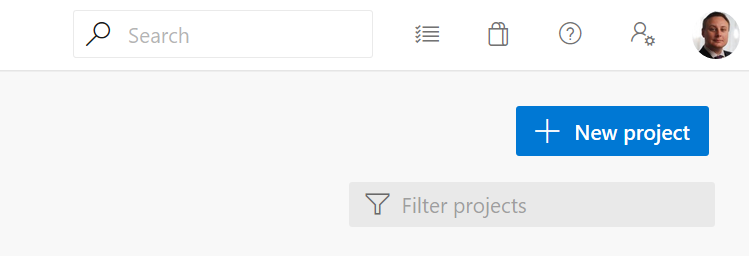

Give your project a name and choose an appropriate visibility.

Your new project will be created. Once it's ready, click on the Repos button and choose to "Initialize with a README" file.

### Azure Data Factory

In the Azure Portal, click "Create a Resource" and then search for Data Factory.

Click create and then name your data factory DevADF followed by the current date (e.g. DevADF20191223). Create a new resource group called ADF and the current date (e.g. ADF20191223). Choose any supported region and do not select Git integration.

Click "Create" and then repeat the process to create another Data Factory in the same resource group. This time use the name DeplADF and the date (e.g. DeplADF20191223). Your Data Factory instances will then deploy to your subscription.

Next, create a storage account called adf followed by the date (e.g. adf20191223). Choose the same region as the data factory instances and select LRF storage to keep the cost down.

Now, browse to the storage and create two containers, one called source and one called sink. Although we won't actually use these, we need something to add to the Data Factory in the template so we will reference them in the pipeline we create later.

### Development Data Factory

Once deployed, browse to your DevADF instance and click the Author and Monitor button to launch the designer interface. Once launched, click the "Author" button on the menu.

Now click on the "Data Factory" drop down and select "Set up code repository". This will launch a wizard to connect your repository.

Select Azure DevOps Git in the repository settings. Follow the wizard to configure the other settings, choosing your DevOps account and the project created earlier in the demo. Choose the Master branch as the Collaboration branch and do not import existing Data Factory resources. Click Apply to complete the wizard.

You'll now be presented with a wizard to create the working branch. Select Create New, then name it featureBranch followed by the date (e.g. featureBranch20191223). Click Save to set this as your working branch.

## Setting up the pipeline

**It is assumed for this section that you already know how to create a pipeline in ADF**

Inside of the DevADF instance, create a new connection.

Next, create two Datasets, one for the source folder and one for the sink. Use CSV as the file type - we won't have any files for this demo so this step is purely to create a pipeline.

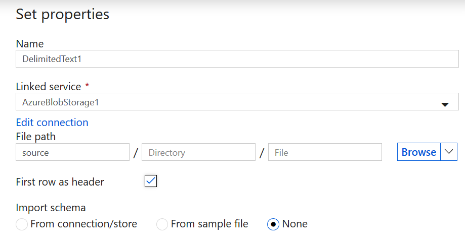

Next, create a pipeline and add a copy job from source to sink.

Finally, click "Save All" on the menu to save the pipeline. At this point your pipeline exists in the feature branch, you can see the JSON files in your Git repository. 

## Merge Branches

On the branch drop down, select "Create Pull Request". You'll be redirected to Azure DevOps to create the pull request. 

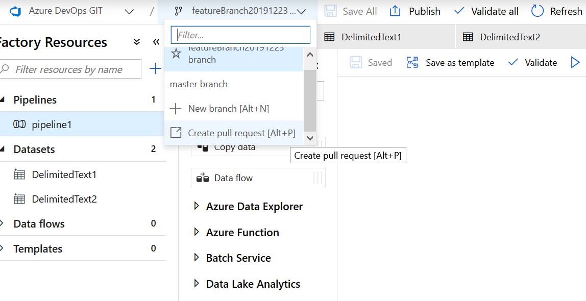

Fill in the relevant details and click Create.

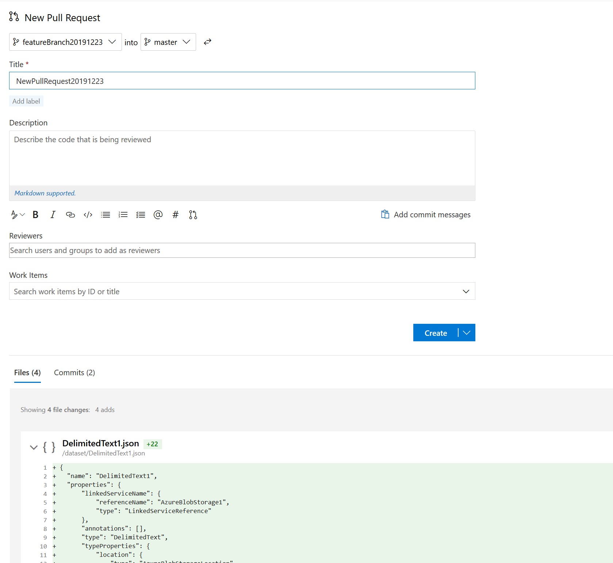

For the purpose of this demo, immediately approve and complete the pull request to merge changes to the collaboration branch.

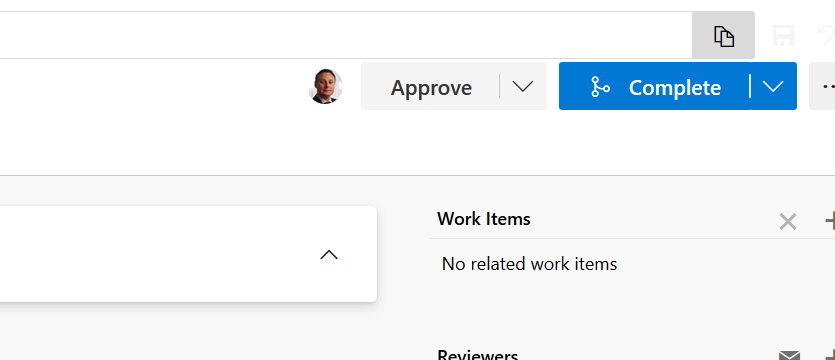

Return to the Data Factory interface tab in your browser and click the branch drop down again. Here, you'll find that the feature branch has been deleted and you'll be asked to select a branch. Click on the master branch for now since we're ready to publish.

## Publish

Once you've selected the master branch, click on Publish. This will show you pending changes from your merge and ask you to confirm. Click OK to accept all. Data Factory will now publish the changes to the development environment and then create a new branch called ADF_Publish into which it will place some ARM templates. Do not edit this branch, it is for publishing purposes only.

## Build

In your DevOps project, click the Pipelines button and go to Builds. Click New Pipeline and select to use the classic editor to create a pipeline. Select Azure Repos Git, then choose your repo and select the ADF_Publish branch. Next, click to start with an empty job.

Click on the Triggers tab and select "enable continuous integration" and then include the ADF_Publish branch to ensure we only start a build when this branch has a new commit.

Click back to the tasks tab. It is here that you may decide to also copy assets for other systems such as Spark or SQL DW. For now, we'll just be building from ADF so click the add task button.

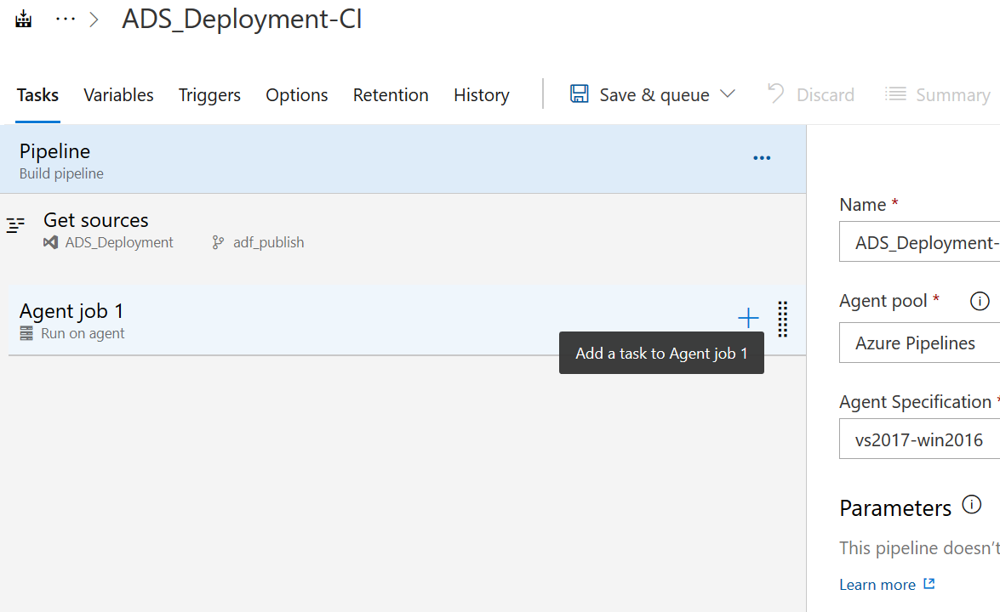

Search for publish artifact and add the Publish Build Artifacts task.

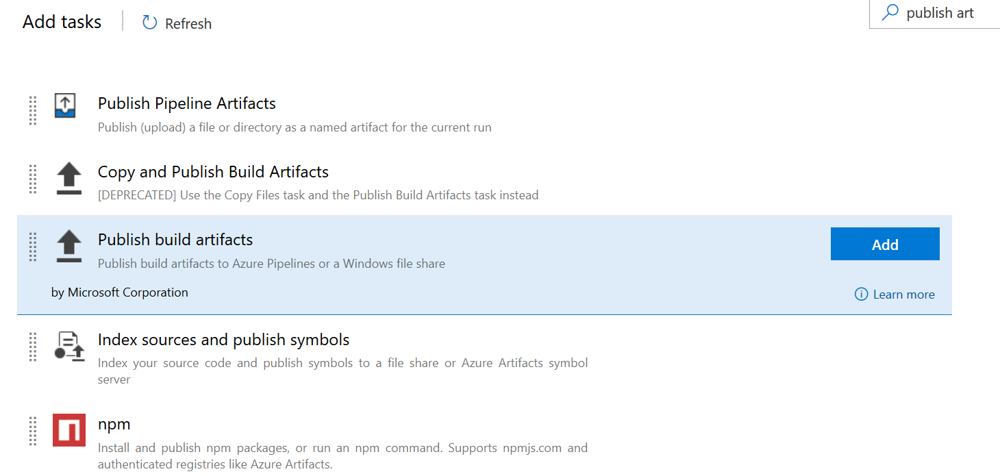

Click on the task to configure and click browse to select the path to publish. Choose the folder in the repository that contains your ARM templates.

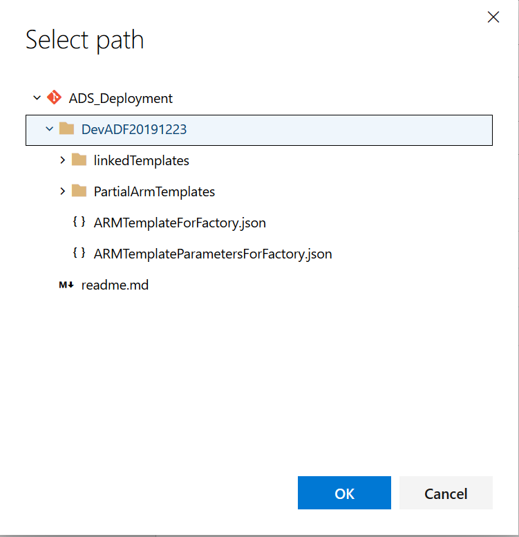

Give the artifact a name of adfTemplate

Click "Save and Queue" on the menu to create your first build artifact. Click Save and Run

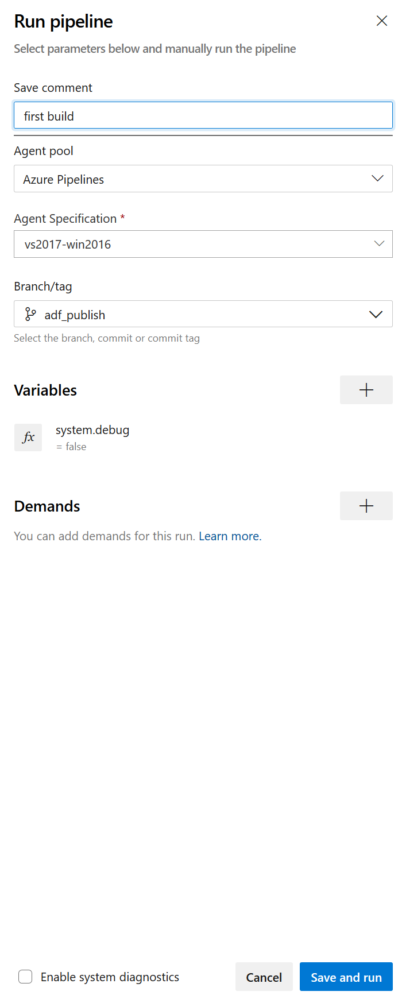

## Releases

Now click on Releases in the menu and then New Pipeline. Again, click to start with an empty job. Give the stage a name such as "TestEnvironment".

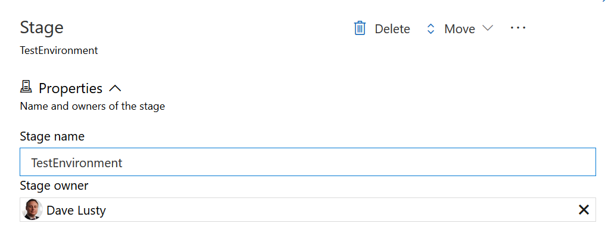

Next, click to add an artifact and select your build.

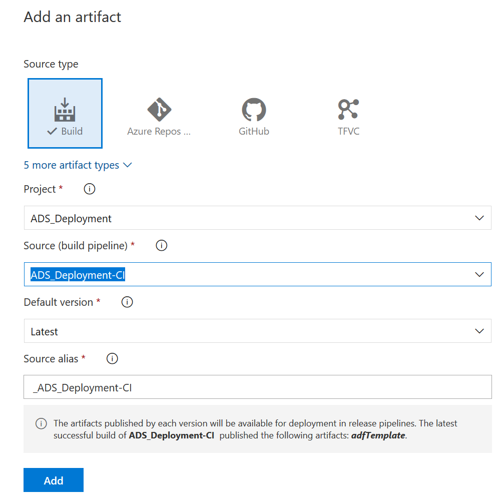

Give your release pipeline a name then click the save button.

Click to view the stage tasks under your test environment.

Add a task to your task list to perform an Azure Resource Group Deployment.

Configure the settings for the task. You'll need to select and authorise your subscription first. Select your resource group and region. Next, select "Linked Artifact" and then browse to the "ARMTemplateForFactory.json" and "ARMTemplateParametersForFactory.json". Override the -factoryName parameter with the name of your DeplADF environment to ensure you overwrite the correct one. Finally, you MUST do this as an incremental deployment otherwised the Data Factory will be removed. Finally click the save button.

The above process can be repeated to add further environments as needed.

## Deploy

Click "Create Release" to test the release pipeline. Usually these would be triggered by the build process but here we'll create it manually. Select the test environment and your artifact and click Create.

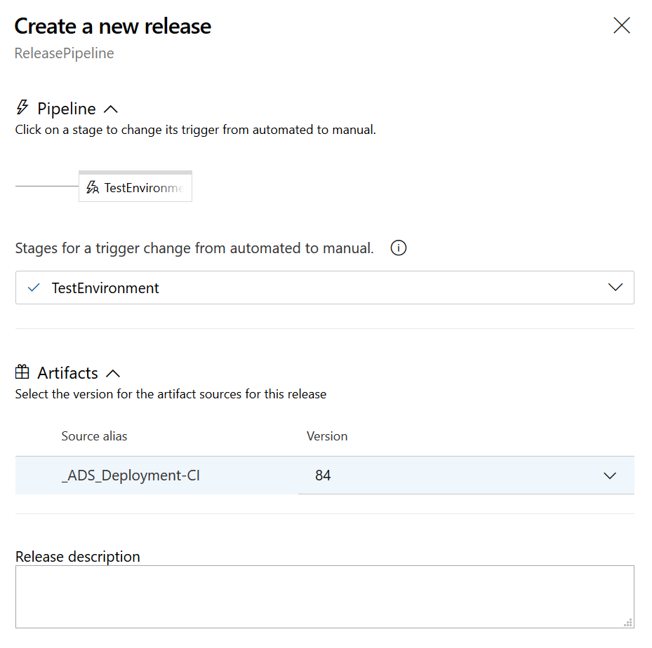

Go back to all releases and click on Release-1.

Click Deploy after hovering over the TestEnvironment box. Click Deploy again to begin deployment. You'll then see the deployment take place. 

You'll see the progress look like the below. Click for more details and logs.

Once complete you can open the DeplADF instance and see the changes which have been deployed. It will be identical to the DevADF instance.

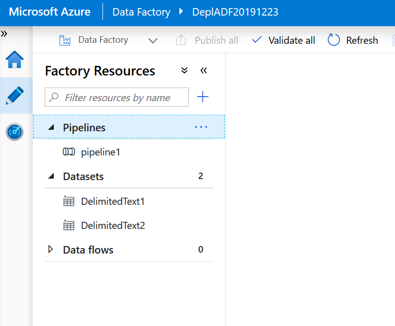

You may now test the deployment process by creating a new branch in the development environment and following the deploy instructions again.