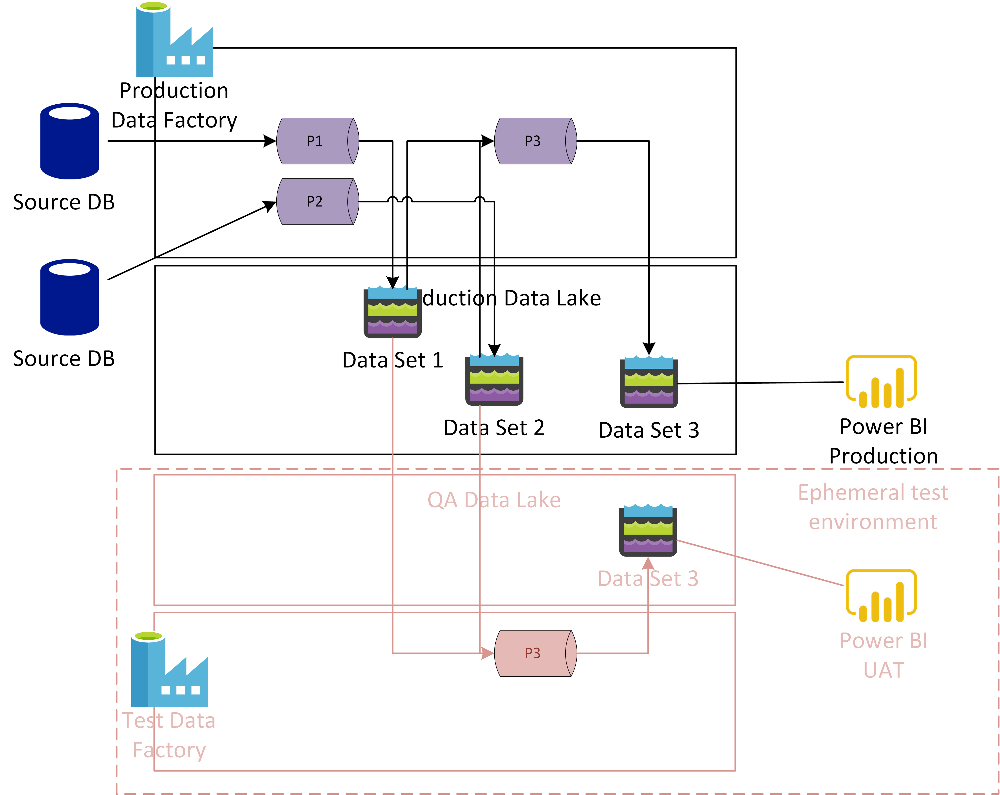
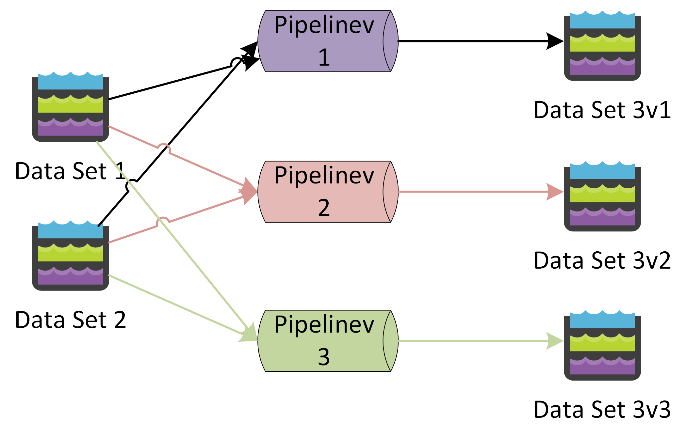

# Data Platform DevOps - Ephemeral Deployments and test environments
**Produced by Dave Lusty**

## Introduction
This demo shows how to use ephemeral deployments in a data lake environment. The video is [not ready yet](https://youtu.be/CW5GXIEhePE)

When creating a DevOps strategy for a data lake the question often comes up of how to create test environments as part of a release pipeline. This is often phrased "how do I clone my production data lake environment for testing or QA?". The answer is, of course, that you can't sensibly clone your data lake if it contains 10PiB of data. Neither would it be sensible to maintain two lake environments since data would gradually drift between the two and eventually require a full clone, potentially costing large sums of money and time.

Instead, it is better to create an ephemeral environment when running your release pipeline and destroy it when the release pipeline is completed. Needless to say a short lived environment should not spend multiple hours copying data, so instead we would use a variable group on the pipeline. In your production version of the pipeline, both source and sink will point to the production copy of the data. In the case of QA your source(s) will still be production data sources, but your sink will be a new storage account location dedicated to the test environment. While it would be possible to use the production storage account, this brings several challenges. First and foremost, it would require the QA environment to have read/write access to the production lake. Ideally you should set up a new permission on the lake with read only access to ensure that the only harm you could do would be if the testing puts a large load on the lake. Secondly is removal at the end of testing, and for this removing a storage account entirely (or a whole resource group including the QA Data Factory) is faster than deleting files. This is especially true of standard blob storage where every file must be touched rather than a whole folder.

In this scenario, many new environments can be created as needed, often one per pipeline for testing purposes.

Using this same technique you can create data set versions. In many scenarios it might be useful to keep your old data pipeline intact for weeks or months after updating it. This allows report versions to continue to be supported which depended on an older data model. At the same time this reduces the risk of changing pipelines and data models since there is a clear and simple roll back mechanism. The obvious downside is that each version will cost a similar amount to process.

