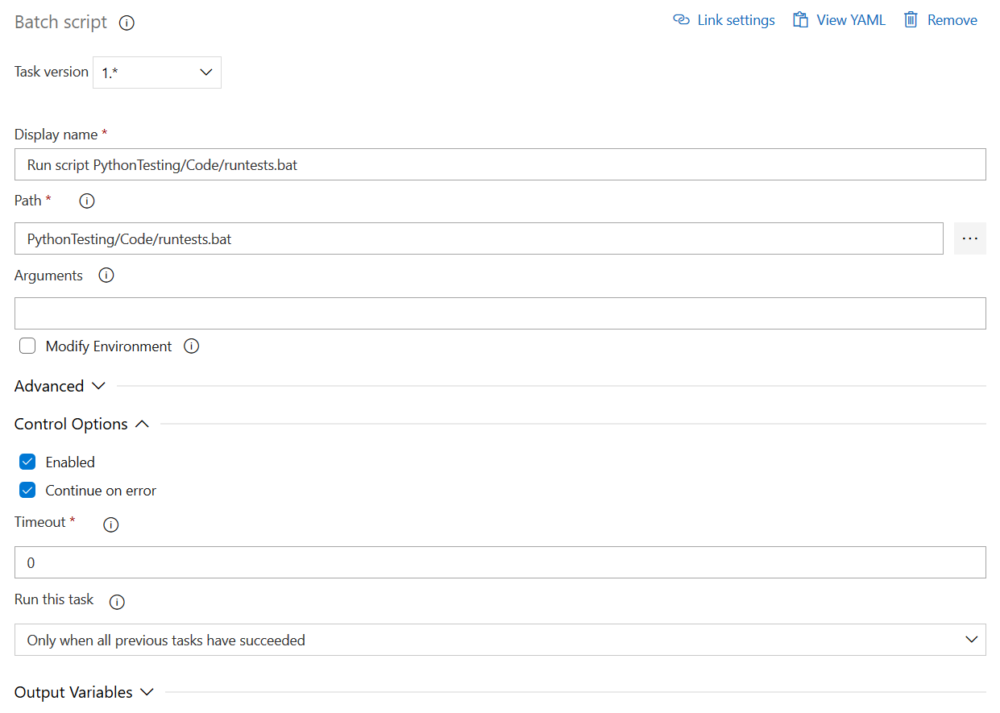
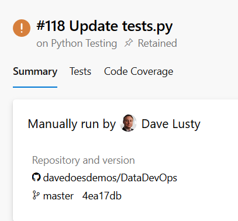
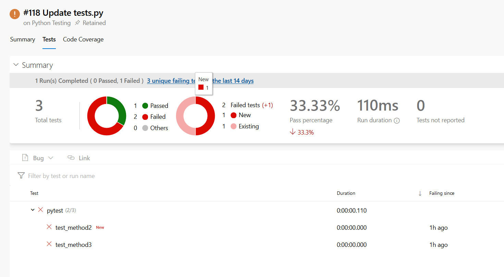

# Data Platform DevOps - Testing

**Produced by Dave Lusty and Cindy Weng**

## Introduction

This demo shows how to use DevOps pipelines to run automated testing in Azure DevOps with Python testing carried out using PyTest. The video is [not available yet](https://youtu.be/R7tJZelEt-Q )

There are multiple tasks associated with this demo:

* Create the test project in Python
* Write individual tests around your testing scenarios
* Set up the tests in Azure DevOps
* Import the test results to the pipeline

## Create Python Test File

The below code gives a very basic introduction to PyTest. For full documentation see [this page](https://docs.pytest.org/en/latest/index.html) which will include information on the various test methods available. For each Python module you create, you should also create unit tests to ensure it produces the expected results. It is generally wise to write your tests before writing your code. As an example, if you created a function to add two numbers you may want a test that calls the function with values of 2 and 3 and expects a response of 5. When working with a data lake you'll need a host of tests including testing outliers to ensure data formats are working as expected. If you're testing dates, use tests in the morning and afternoon, before and after noon and midnight, and whole hours as well as precise times. Map out your expected results first, write the tests and then create test data to match and run against.

The code below has been designed to produce one pass and two failures, and matches the C# code in the [testing intro demo](https://github.com/davedoesdemos/DataDevOps/tree/master/TestingIntro).

Test 1 will test whether 3 is equal to 2 with an accuracy of 1 - this will pass.
Test 2 will test whether 3 is equal to 6 with an accuracy of 1 - this will fail.
Test 3 will test whether 3 is equal to 2 with no margin for error - this will fail.

```Python
import pytest
from pytest import approx

def test_method1():
    x=3
    y=2
    assert x == approx(y, 1)

def test_method2():
    x=3
    y=6
    assert x == approx(y, 1)

def test_method3():
    x=3
    y=2
    assert x == y
```

You can add any code you like within the tests to connect to data sources, filesystems or any other programatic testing you can think of. For unit testing this will usually be your own libraries while integration testing will test the wider environment.

Save the above code into a file named tests.py in your Git repository. This is where Azure DevOps will get the file from when you commit it and run a build against the repository.

## Create Batch File

Create a batch file in your repository called runtests.bat. This file will install PyTest and then run the tests. Replace `<your path to tests>` with the path in your repository to the test files.

```
pip install pytest
pytest <your path to tests>\tests.py --junitxml=<your path to tests>\results.xml
```

## Running the Tests

### Running the tests locally

When writing code, you should test it locally before commiting to the repository. To do this, install PyTest and run the test as follows from the command line:

```
pip install pytest
pytest tests.py
```

This will install the PyTest module and then use it to run the tests in the tests.py file. You will see the results directly on your screen. When unit testing you would then correct any errors in your code and run the tests again.

### Running the tests in Azure DevOps

To run the tests in Azure DevOps, create a project and pipeline as in the [testing intro demo](https://github.com/davedoesdemos/DataDevOps/tree/master/TestingIntro). This time we will add in a Batch Script task and a Publish Test Results task. For this demo I used a Windows agent for Azure DevOps, but a Linux agent would work in the same way using a shell script.

Configure the batch task to run your runtests.bat file, which you can browse to using the browse button on the task. Also expand the "Control Options" section and choose "Continue on Error" for this task. When a test fails the batch file outputs a failure code but we want to carry on and publish the results to the build rather than fail completely.



Configure the publish task to publish the results.xml file. This will end up in the same location as your batch file and tests.py file when the tests run. This task will copy the results into the build so you can view the results easily and see what changed through integration with Git and Boards in the DevOps portal.


Save and queue the job in DevOps to see the tests run.

## View the Results

In your build output, click the tests tab.



Here you'll see the output of the tests and which ones have failed. You should see one pass and two failures based on the (fixed) tests we performed. Your own testing will be more dynamic than this.

