# Data Platform DevOps - Testing Intro

**Produced by Dave Lusty**

## Introduction

This demo shows how to use unit testing projects to perform tests in Azure DevOps pipelines to perform automated testing. This demo won't show any useful tests, but instead focusses on how to create and run tests. The video is [here](https://youtu.be/H_IaqNDJ11c)

## Setup

### Azure DevOps Project

First, we need to set up an Azure DevOps project which will house the code and pipelines used for this testing. Log into the portal at [https://dev.azure.com](https://dev.azure.com) and click on New Project

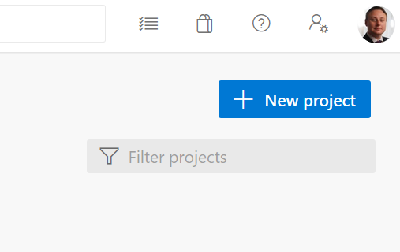

Give the project a name and select private, then click Create

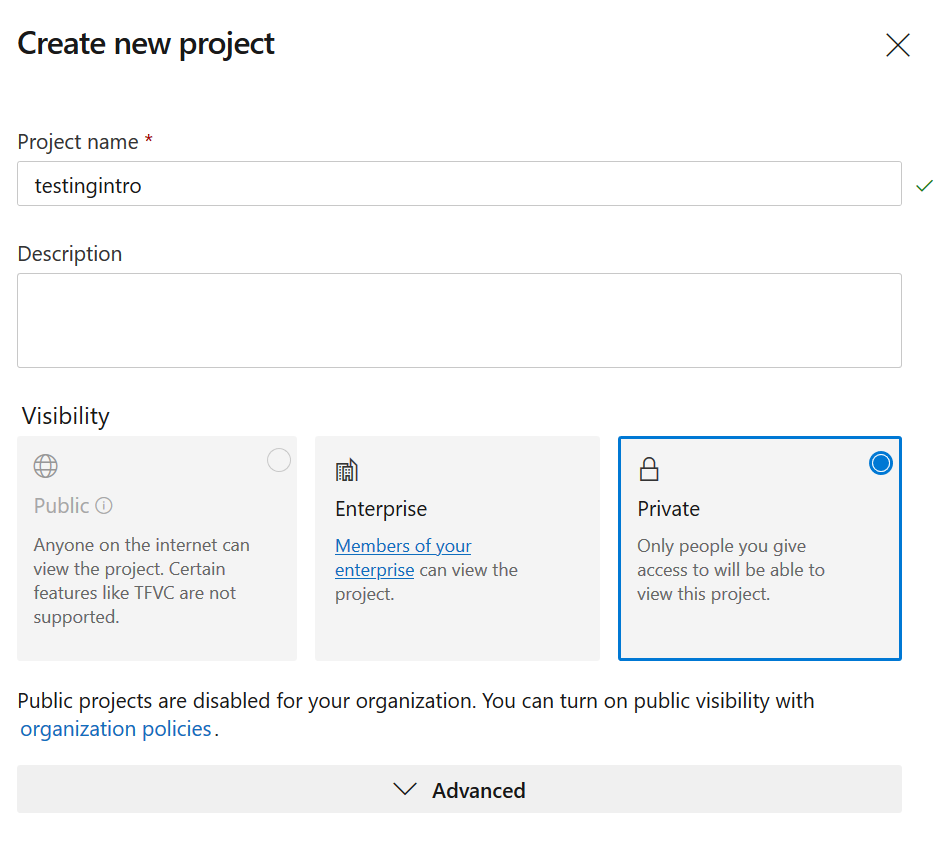

Once the project is created, click on Repos and then initialize to set up the repository

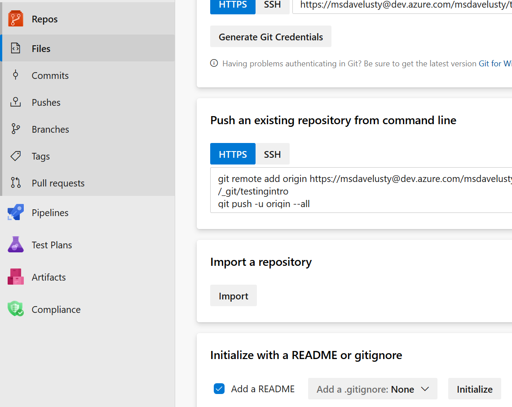

Once the repository is ready, clone it to your machine

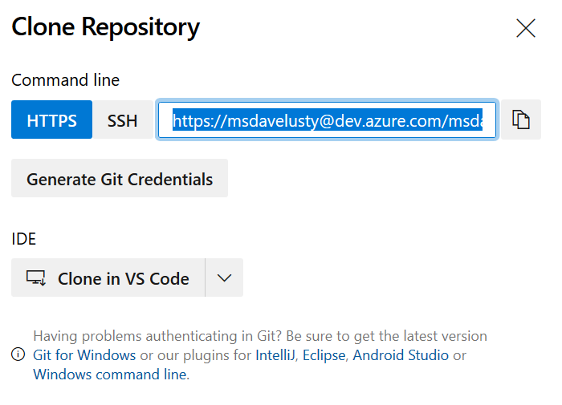

### Visual Studio Project

Open Visual Studio and click Create a new project

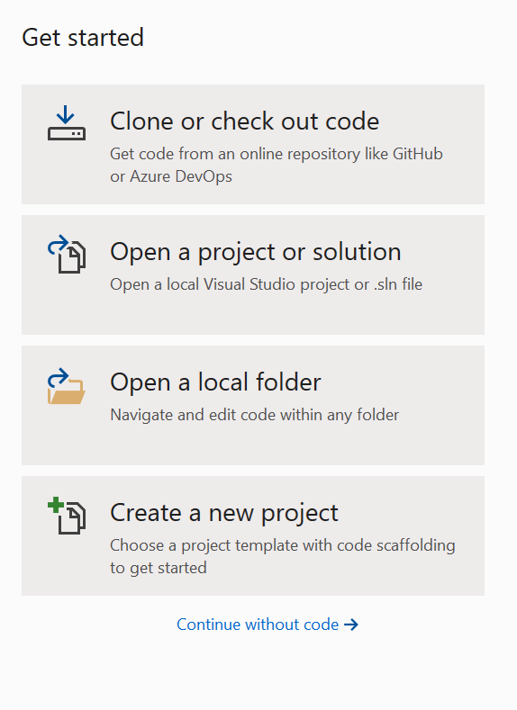

Search for Unit Test Project and select the .net version

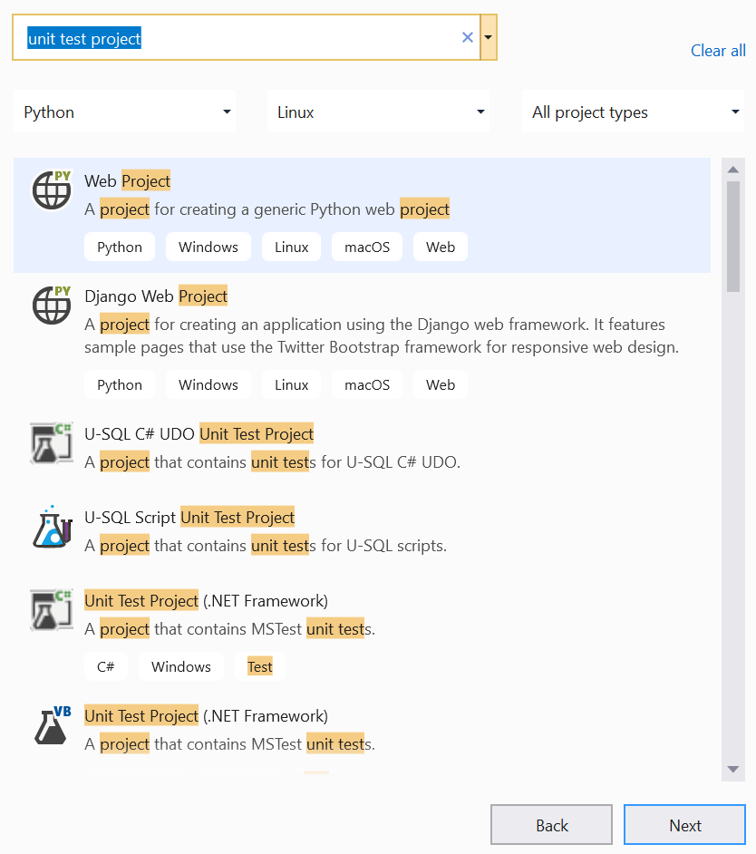

give the project a name and store it in the repo you cloned above then click Create

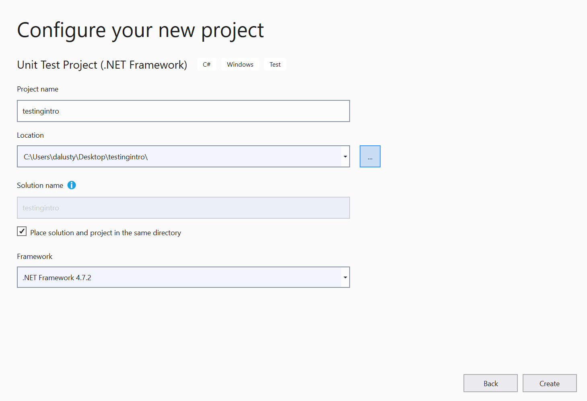

Once the project is created, add the following line of code to TestMethod1:

```csharp
Assert.AreEqual(3, 2, 1, "Numbers don't match");
```

This line will test the value 2, our "actual" value against the "expected" value of 3 with a delta of 1. This means any value within a range of 1 from 3 will pass the test. Usually we would use variables for these valuse, and in real testing you'd be looking up the actual value from somewhere such as a database or the output of a procedure in your code. For this demo we're using fixed values because it's easy to see why things pass and fail without any external factors.

Next, copy the whole TestMethod twice and change the assert line as follows:

```csharp
        [TestMethod]
        public void TestMethod1()
        {
            Assert.AreEqual(3, 2, 1, "Numbers don't match");
        }

        [TestMethod]
        public void TestMethod2()
        {
            Assert.AreEqual(3, 6, 1, "Numbers don't match");
        }

        [TestMethod]
        public void TestMethod3()
        {
            Assert.AreEqual(3, 2, 0, "Numbers don't match");
        }
```

Now we have three tests. All tests expect a value of 3. The first should pass because 2 is within 1 of 3. The second should fail because 6 is more than 1 away from 3. The final test should fail because 2 is not identical to 3 (0 difference expected)

On the menu, click Test, Run All Tests. You will then see the project build and a test window pop up. You should get the following output as expected.


Now save all changes and commit them to the repository using Git.

### Build pipeline

In your Azure DevOps project click on Pipelines and then Create Pipeline

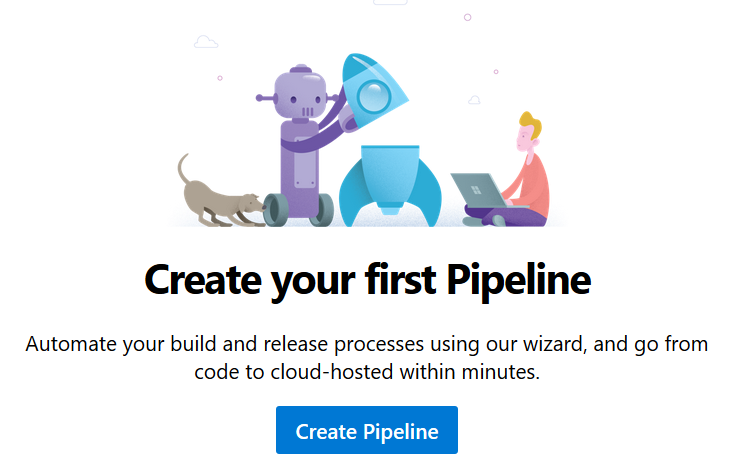

Click Use the classic editor to create the pipeline with the GUI rather than YAML. The same can be achieved with YAML, but for this demo classic is simpler.

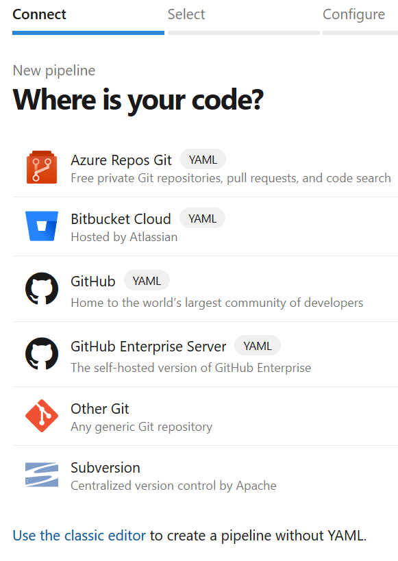

Select your repo and the master branch and click Continue

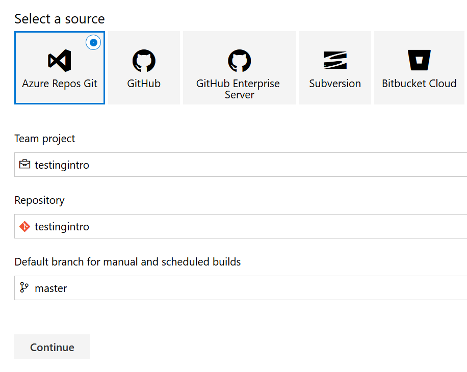

Click to start with an Empty Job

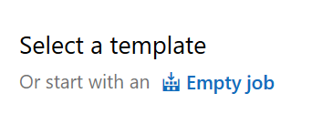

Click the + next to Agent Job 1 to add a task to your build pipeline. Search for Visual Studio Build and add this task to the pipeline

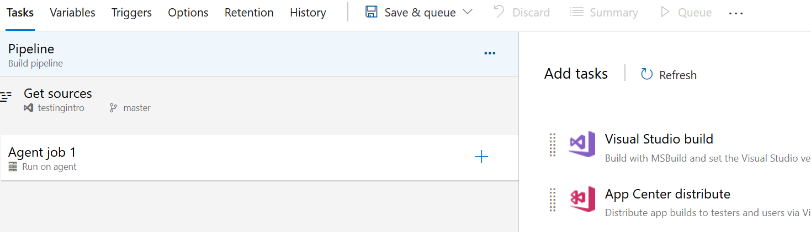

Next, add a "Visual Studio Test Platform Installer" task and a "Visual Studio Test" task

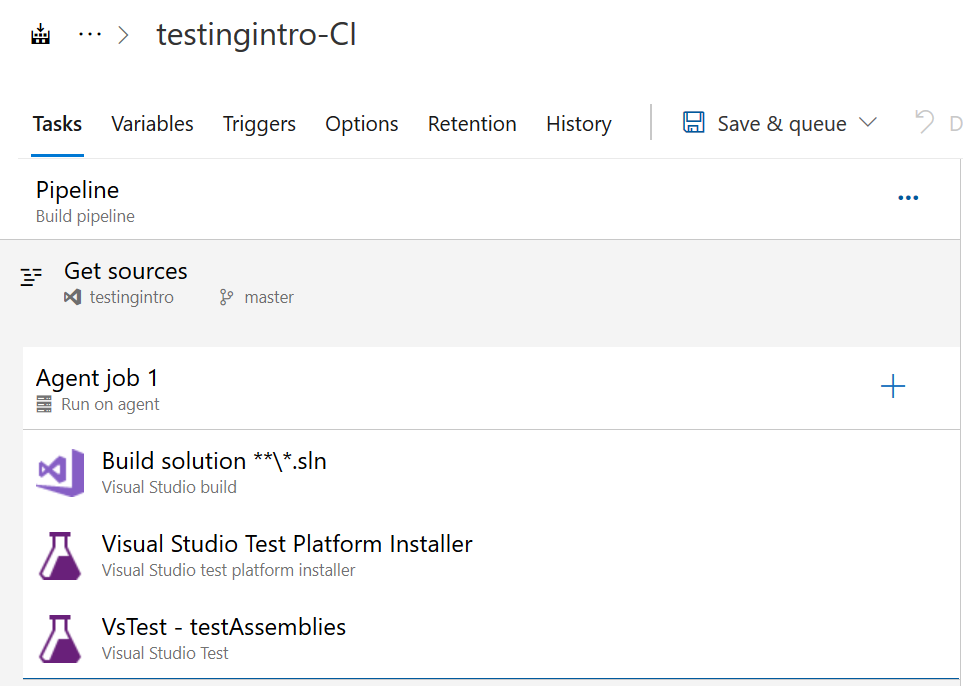

Click on the Build Solution task and then select your test solution file. Set the platform to "Any CPU" and Configuration to "Release". Tick the "Clean" box.

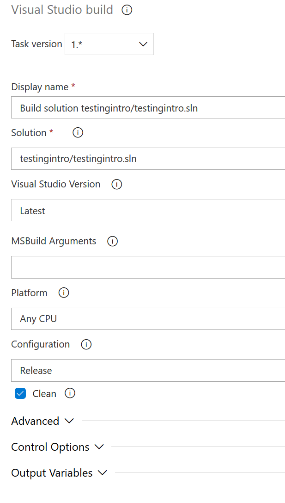

The other two tasks don't need to be configured for this demo, but please do look at the settings and familiarise yourself with them. Next, click "Save and Queue" to start the build. Give the save a comment and click Save and run

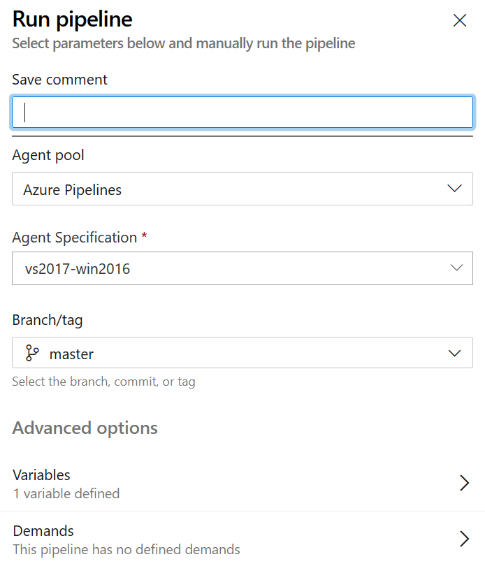

The job will now run on an agent, you can watch progress by clicking Agent job 1

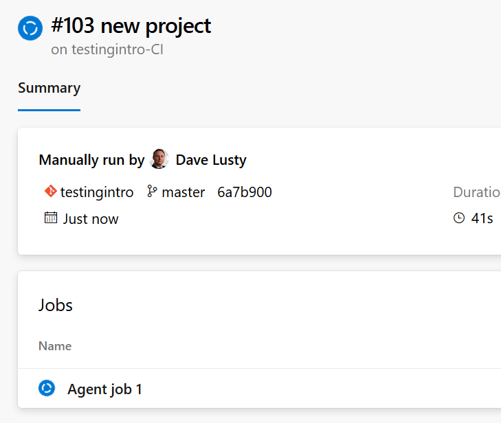

You'll then see your tasks running

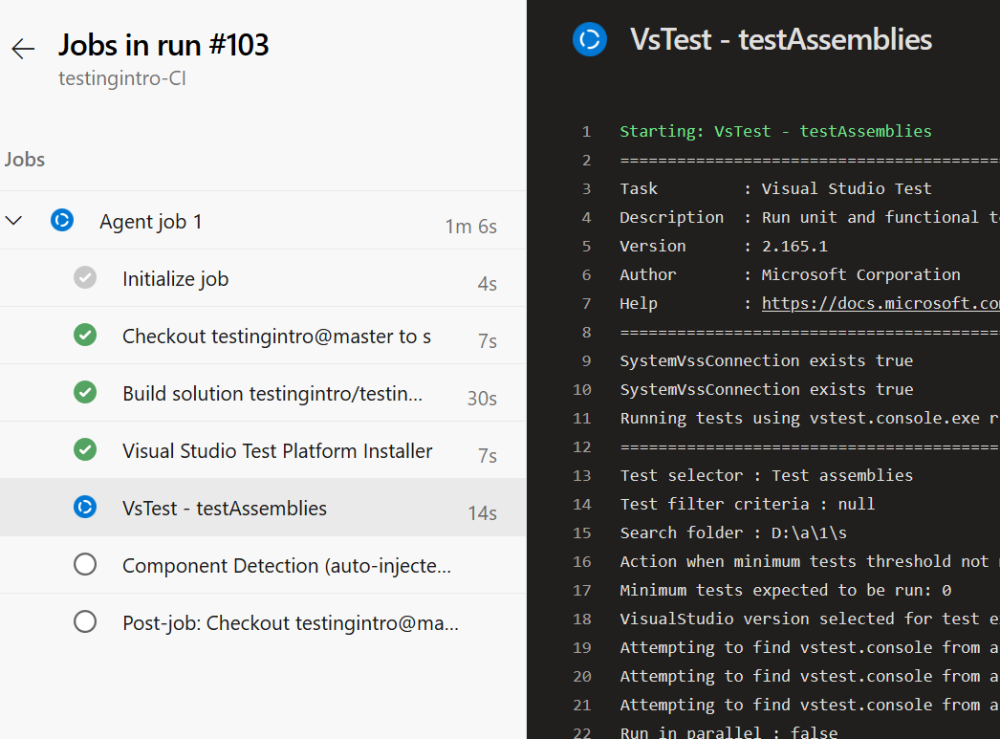

You will eventually get a failed task because we intentionally made tests which fail. Don't worry about this, it's by design. Click "Jobs in run #xx" to return to the build. Click the Tests tab and then set the filter to include successful tests

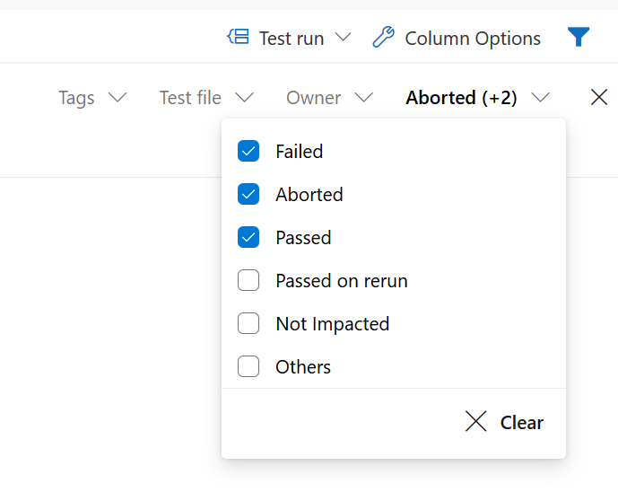

You'll then see your passed and failed tests. You may find these are doubled up if you had a previous debug build from testing locally in the repo since the task will by default run all tests in the folder

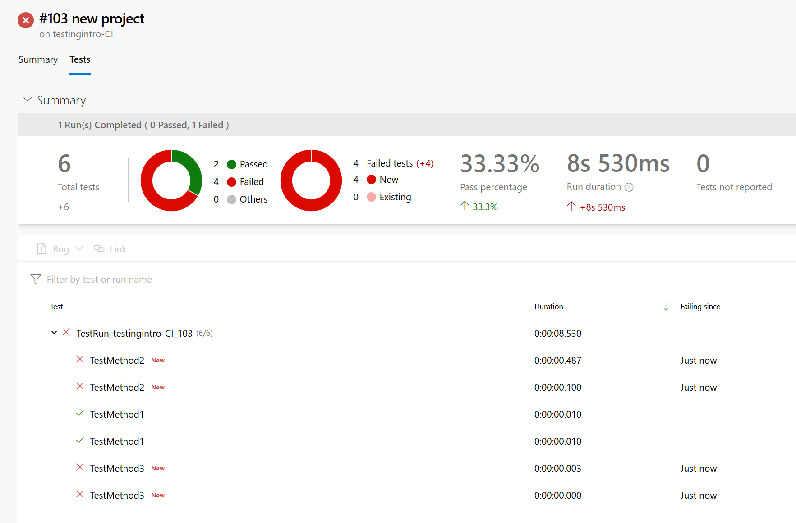

As you can see, by default the build fails if tests fail, so your releases would not be triggered. Next steps from here are to set up more realistic tests, something covered in the next demo in this series.